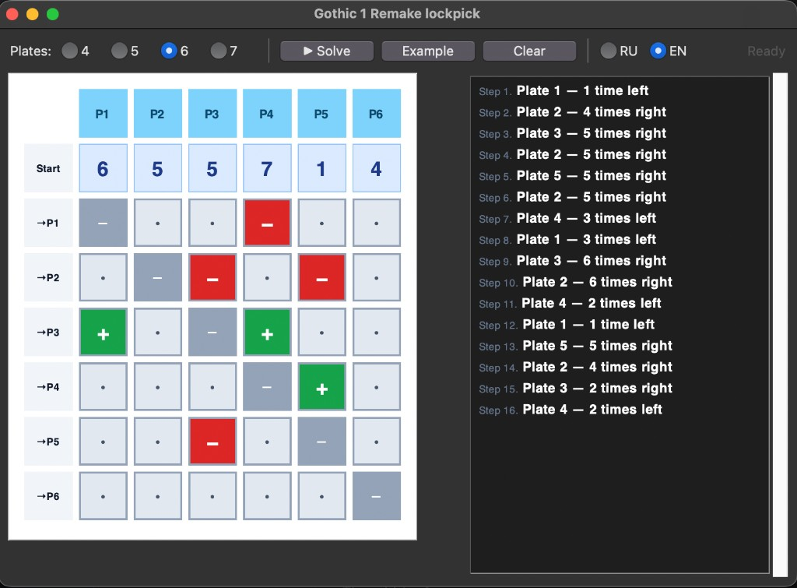

# Gothic 1 Remake — Lockpick Solver

Помощник для мини-игры со взломом замков в **Gothic 1 Remake**: вводите стартовые положения и связи между пластинами — получаете пошаговое решение.

A helper for the **Gothic 1 Remake** lockpick minigame: set starting positions and plate links, get a step-by-step solution.

**[Русский](#русский)** · **[English](#english)**



---

## Русский

### Как устроена головоломка

- От **4 до 7** пластинок, каждая в положении **от 1 до 7** (без зацикливания).
- Цель — выставить **все пластинки на 4**.
- Любую пластинку можно сдвинуть **влево** или **вправо**; при сдвиге связанные пластинки тоже двигаются (+1 в ту же сторону, −1 в противоположную).
- Ход допустим, только если ни одна пластинка не выходит за границы 1…7.

### Что умеет программа

- Графический интерфейс: сетка «старт + влияния», кнопка «Решить», встроенный пример (см. скриншот выше).
- Интерфейс и текст решения на **русском** и **английском** (переключатель RU / EN).
- Пошаговый вывод вроде: *«Пластинку 2 — 4 раза вправо»*.
- Сборка в **один исполняемый файл** (macOS / Windows / Linux).

### Зависимости

- **Запуск из исходников:** Python **3.10+** со встроенным **tkinter** (отдельные пакеты не нужны).
- **Сборка бинарника:** [PyInstaller](https://pyinstaller.org/) — ставится автоматически при первом запуске `build.sh` / `build.bat`.

### Как запустить

```bash
python3 plate_puzzle_gui.py
```

Консольная версия (без GUI):

```bash
python3 plate_puzzle_solver.py \
  --positions 6,5,5,7,1,4 \
  --influences-json '{"1":{"3":1},"3":{"2":-1,"5":-1},"4":{"1":-1,"3":1},"5":{"2":-1,"4":1}}'
```

Справка: `python3 plate_puzzle_solver.py` или `-h`. Язык вывода: `--lang en` (по умолчанию) или `--lang ru`. Флаг `--example` — только для быстрой проверки без JSON.

### Сборка бинарника

**macOS / Linux:**

```bash
chmod +x build.sh   # один раз, если скрипт не исполняемый
./build.sh
# → dist/PlatePuzzle
```

**Windows:**

```bat
build.bat
REM → dist\PlatePuzzle.exe
```

Каталоги `build/` и `dist/` создаются PyInstaller и перечислены в `.gitignore`.

### Алгоритм (кратко)

Задача — найти хорошую последовательность ходов в огромном, но конечном графе всех допустимых положений пластин.

1. **Двунаправленный поиск в ширину** — быстро находим минимальное число ходов до цели.
2. **Поиск в ширину по слоям** — среди всех кратчайших путей выбираем тот, где меньше всего **переключений между пластинками** (удобнее повторять в игре).
3. Небольшая **перестановка ходов** в конце — сгруппировать одинаковые сдвиги одной пластинки, если это не меняет результат.

Итог: сначала минимум ходов, потом минимум «прыжков» между пластинками.

### Файлы

| Файл | Назначение |
|------|------------|
| `plate_puzzle_gui.py` | GUI |
| `plate_puzzle_solver.py` | Алгоритм и CLI |
| `i18n.py` | Строки RU / EN |
| `PlatePuzzle.spec` | Конфигурация PyInstaller |
| `build.sh` / `build.bat` | Сборка бинарника |

---

## English

### The puzzle

- **4 to 7** plates, each at position **1–7** (no wrapping).
- Goal: get **every plate to 4**.
- Any plate can move **left** or **right**; linked plates move too (+1 same way, −1 opposite).
- A move is valid only if every affected plate stays within 1…7.

### Features

- Grid UI for start positions and influence links, built-in example, one-click solve (see screenshot above).
- **Russian** and **English** UI and solution text (RU / EN toggle).
- Step-by-step output like: *“Plate 2 — 4 times right”*.
- **Single-file** builds for macOS, Windows, and Linux.

### Dependencies

- **Run from source:** Python **3.10+** with **tkinter** (no extra pip packages).
- **Build a binary:** [PyInstaller](https://pyinstaller.org/) — installed automatically on the first `build.sh` / `build.bat` run.

### Run

```bash
python3 plate_puzzle_gui.py
```

CLI (no GUI):

```bash
python3 plate_puzzle_solver.py \
  --positions 6,5,5,7,1,4 \
  --influences-json '{"1":{"3":1},"3":{"2":-1,"5":-1},"4":{"1":-1,"3":1},"5":{"2":-1,"4":1}}'
```

Help: `python3 plate_puzzle_solver.py` or `-h`. Output language: `--lang en` (default) or `--lang ru`. The `--example` flag is only for a quick smoke test without JSON.

### Build a standalone binary

**macOS / Linux:**

```bash
chmod +x build.sh   # once, if the script is not executable
./build.sh
# → dist/PlatePuzzle
```

**Windows:**

```bat
build.bat
REM → dist\PlatePuzzle.exe
```

The `build/` and `dist/` directories are produced by PyInstaller and listed in `.gitignore`.

### How it solves (short version)

The game state is a vertex in a graph; each move is an edge. We want a path to “all plates at 4” that is short and practical to follow.

1. **Bidirectional BFS** — find the minimum number of moves quickly.
2. **Layered BFS** — among all shortest paths, pick one with the fewest **switches between plates** (fewer back-and-forth in the UI).
3. Light **move reordering** at the end — batch consecutive moves on the same plate when the outcome stays the same.

Priority: fewest moves first, then fewest plate switches.

### Files

| File | Purpose |
|------|---------|
| `plate_puzzle_gui.py` | GUI |
| `plate_puzzle_solver.py` | Solver + CLI |
| `i18n.py` | RU / EN strings |
| `PlatePuzzle.spec` | PyInstaller configuration |
| `build.sh` / `build.bat` | Binary build scripts |

---

*Fan tool, not affiliated with THQ Nordic or Alkimia Interactive.*

*Инструмент на ~99% вайбкод / ~99% vibe coded.*
